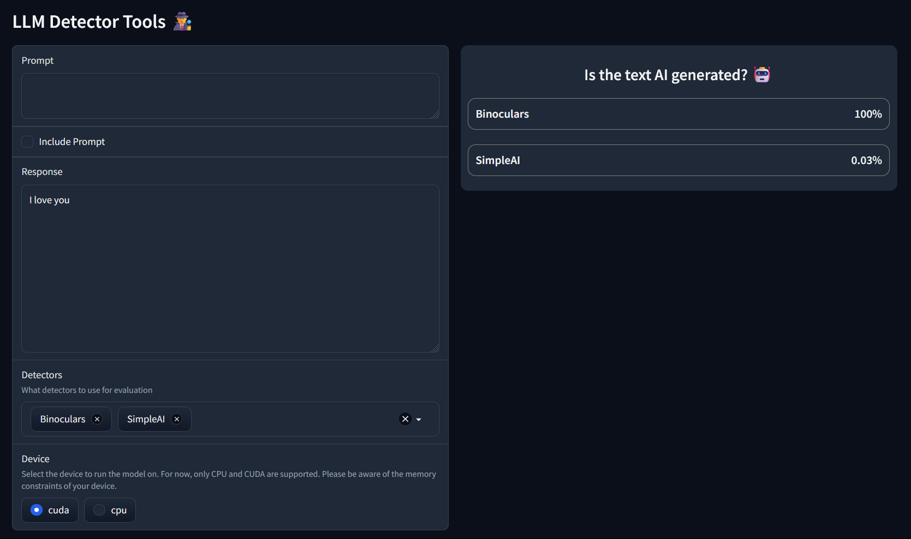

# LLM Detector 🕵️‍♂️

This project aims to offer unified tools for testing and using LLM detectors.

## Currently Supported

- [x] [SimpleAI](https://huggingface.co/Hello-SimpleAI/chatgpt-detector-roberta)
- [x] [Binoculars](https://github.com/ahans30/Binoculars)
- [x] Ghostbuster
- [ ] DetectGPT
- [ ] DetectLLM
- [ ] Fast-DetectGPT

## Gradio Interface

To use the interface, run the following command `python app.py` and open the provided link in your browser.
